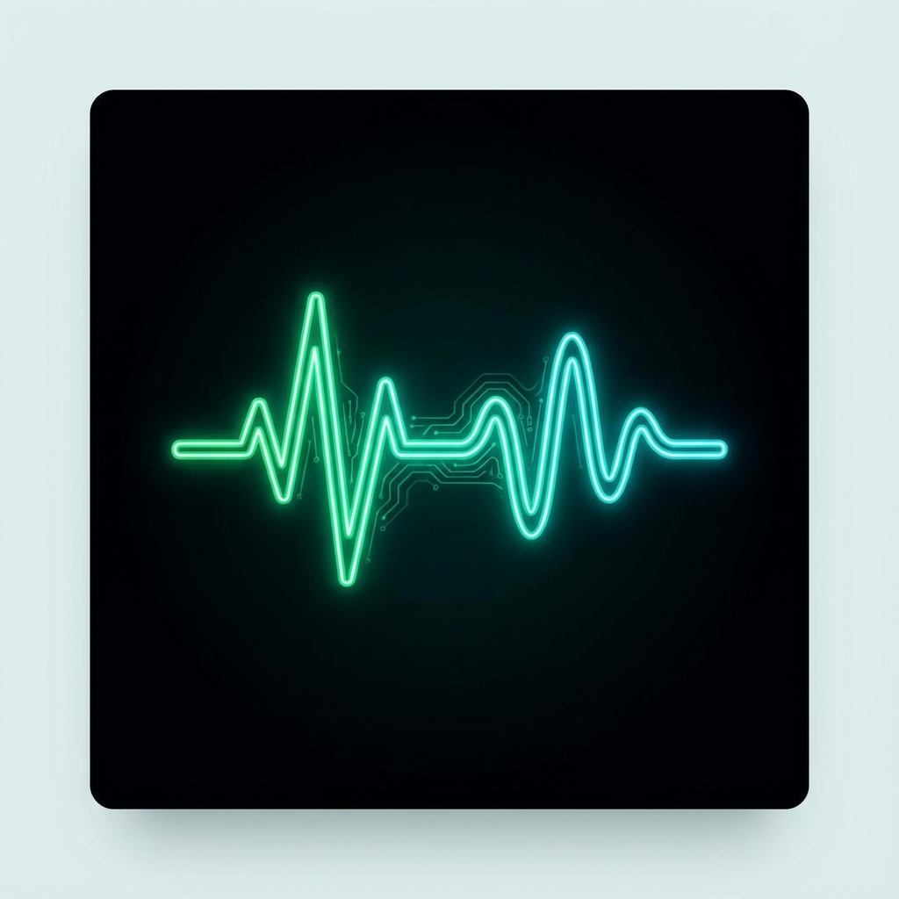
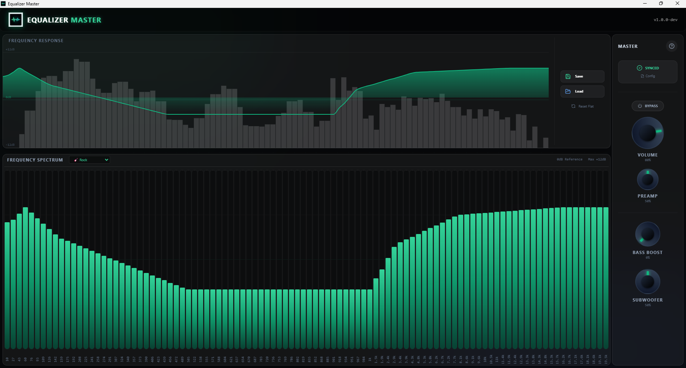
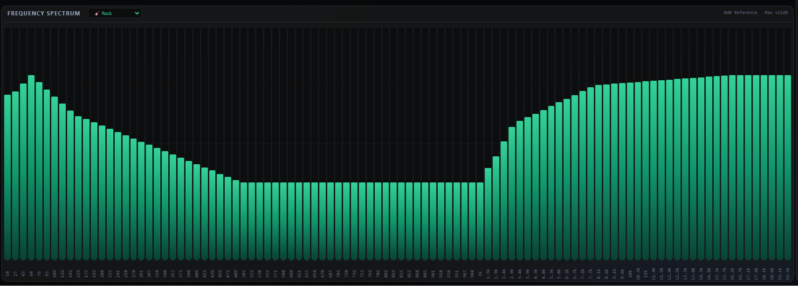
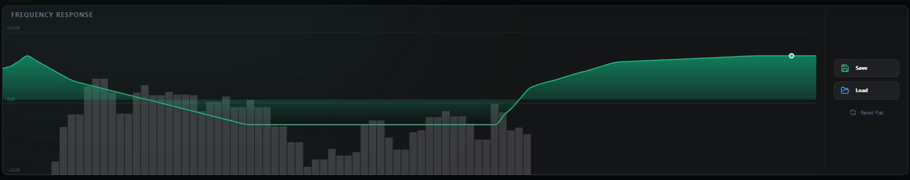
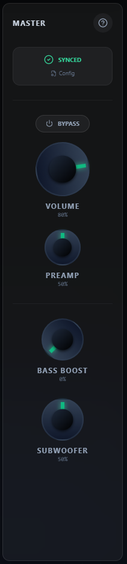

# Equalizer Master 🎧



**Equalizer Master** is a high-fidelity, modernized GUI for **Equalizer APO** on Windows. It offers granular audio control with a 100-band parametric equalizer, real-time spectrum visualization, and a premium "Glassmorphism" interface.

> **⚠️ REQUIREMENT:** This application acts as a controller. You MUST have **[Equalizer APO](https://sourceforge.net/projects/equalizerapo/)** installed and configured on your system for the audio effects to work.

---

## 📸 Interface Gallery

### Main Interface
A complete overview of the precision audio workspace.


### Real-time Visualization
**Frequency Spectrum (Left)** and **Response Curve (Top)**.
See exact frequency feedback in real-time as you listen.



### Precision Controls
Independent **Preamp**, **Bass Boost**, **Subwoofer Gain**, and master **Volume** control with dedicated bypass switch.


---

## ✨ Key Features

-   **🎚️ 100-Band Equalizer**: Unmatched precision compared to standard 10/15 band EQs.
-   **📈 Smooth Presets**: Intelligent interpolation for genre presets (Rock, Pop, Jazz, etc.) creates natural, non-stepped curves.
-   **⚡ Real-Time Sync**: Changes are written instantly to Equalizer APO's config with zero latency.
-   **📊 Dual Visualizers**:
    -   *Input Spectrum*: Shows what's playing now.
    -   *EQ Curve*: Shows how your settings affect the sound.
-   **🎛️ Dedicated Preamp**: Boost quiet sources without distorting the entire mix.
-   **🔊 Subwoofer & Bass Control**: Targeted low-frequency enhancement logic.
-   **🚀 System Integration**:
    -   Minimizes to System Tray.
    -   Portable (No permanent installation required).
    -   Auto-loads last used configuration.

---

## 🚀 Getting Started

### 1. Prerequisites
1.  Download and Install **Equalizer APO**.
2.  During installation, select your primary audio device (Speakers/Headphones).
3.  Restart your computer.

### 2. Installation / Running
You can run this app in two ways:

**Option A: Portable (Recommended)**
1.  Download the latest release.
2.  Extract the folder.
3.  Run `Equalizer Master.exe`.

**Option B: Setup**
1.  Run `Equalizer Master Setup.exe` to install it to your system.

### 3. First Setup
When you first open the app, it will ask for a **Config File**.
1.  Navigate to your Equalizer APO installation folder (usually `C:\Program Files\EqualizerAPO\config`).
2.  Select `config.txt`.
3.  Done! Start tweaking sliders.

---

## 🛠️ for Developers

Built with modern web technologies on the Desktop:

-   **Electron**: App Runtime.
-   **Vite**: Next-gen bundler (Fast HMR).
-   **React**: UI Library.
-   **TypeScript**: Type safety.
-   **TailwindCSS**: Styling engine.
-   **Zustand**: State management.
-   **Recharts**: Graph rendering.

### Development Commands

```bash
# Install Dependencies
npm install

# Run Dev Server
npm run dev

# Build for Production (Win/Portable)
npm run build
```

---

## 📄 License

Open Source. Feel free to fork, modify, and distribute.
Created by **Maskoding**.

---

## 📦 Release Notes (v1.2.0)

**New Pro Audio Controls**
-   **🎤 VOCAL**: Targeted presence boost (2.5kHz) to bring vocals forward.
-   **🎸 MID**: Enhance body and thickness (1kHz) for instruments.
-   **✨ HIGH**: Add air and sparkle (8kHz+) for crystal clear details.
-   **🔊 LOUDNESS (LOUD)**: "Smile Curve" contour (Low+High Boost) for powerful dynamic sound at any volume.

**Enhancements**
-   **🎛️ New Layout**: Compact side-by-side knob arrangement for better usability.
-   **💾 New Presets**: Added 10+ new professional genres (Acoustic, Gaming, Cinema, Bass Booster, etc.).
-   **🐛 Fixes**: Resolved duplicate preset bugs and config synchronization issues.
